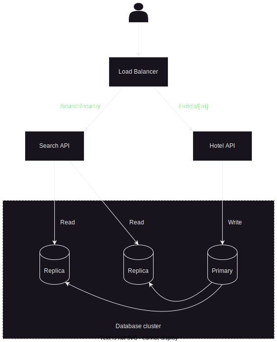

<a name="readme-top"></a>
<!-- Head section -->
<div align="center">
  <a href="https://github.com/Eiliv17/HotelFinder">
    
  </a>

  <h1 align="center">Hotel Finder Web App</h1>

  <p align="center">
    Hotel finder website created in Vue.js with a backend written in Go using the Gin web framework and MongoDB as database for Geospatial Queries
  </p>
</div>

<!-- Table of contents -->
<details>
  <summary>Table of Contents</summary>
  <ol>
    <li>
      <a href="#about-the-project">About The Project</a>
      <ul>
        <li><a href="#api-endpoints">API Endpoints</a></li>
        <ul>
            <li><a href="#api-for-search">API for search</a></li>
            <li><a href="#api-for-hotels">API for hotels</a></li>
        </ul>
        <li><a href="#readwrite-ratio">Read & Write Ratio</a></li>
        <li><a href="#data-model">Data Model</a></li>
        <ul>
            <li><a href="#hotel-object">Hotel Object</a></li>
            <li><a href="#point-object">Point Object</a></li>
        </ul>
        <li><a href="#high-level-design">High Level Design</a></li>
        <li><a href="#built-with">Built With</a></li>
        <li><a href="#getting-started---setup">Getting Started</a></li>
      </ul>
    </li>
    <li><a href="#license">License</a></li>
  </ol>
</details>

<!-- About the project section -->
## About The Project
This is an example of a Nearby search REST API for searching nearby hotels, in this case all routes are accessible by anyone but in a real life scenario the search API is going to be used by users and only the hotels API or at least the writing parts of it will be accessible to the hotel owners.

### API Endpoints
Here are the available endpoints for now:

#### API for search
GET /v1/search/nearby
This endpoint returns hotels based on certain search criteria. In real-life applications, search results are also paginated so we need to add parameters for that.

Request Parameters:

| Field         | Description                           | Type
| ---           | ---                                   | ---
| latitude      | Latitude of a given location          | decimal
| longitude     | Longitude of a given location         | decimal
| radius        | Optional. Default is 5000 meters      | int
| offset        | Optional. Defaul is 0                 | int
| limit         | Optional. Default is 20               | int

The hotel object returned contains everything needed to render the search result page. But we may still need additional attributes such as pictures, reviews, star rating, etc., to render each hotel detail page when we visit them.

In the future we can also add more complex searches like let a user define an area which will be formatted as GeoJSON and then send that to the backend and return only hotels in that area. Or even add search filters like star rating, price, etc.


#### API for hotels
The APIs related to an hotel object are shown in the table below:

| API                       | Detail
| ---                       | ---
| GET /v1/hotels/:id        | Return detailed information about a business
| POST /v1/hotels           | Add an hotel
| PUT /v1/hotels/:id        | Update details of an hotel
| DELETE /v1/hotels/:id     | Delete an hotel

<p align="right">(<a href="#readme-top">back to top</a>)</p>


### Read/Write Ratio
Since most of the time we're going to use the search for nearby hotels API and also the view information about an hotel, most likely we're going to have an high read volume. The write on the other hand is low since it happens only when we're adding, removing or updating an hotel page.

Most of the time for a read-heavy system, a relational database such as MySQL is a better fit than other solutions. But for ease of development we're going to use MongoDB with its built-in support for Geospatial Queries which are easy to use than MySQL Geo Queries.

<p align="right">(<a href="#readme-top">back to top</a>)</p>

### Data Model

#### Hotel Object

| Variable          | Type          | Description
| ---               | ---           | ---
| name              | String        | Name of the hotel
| starRating        | Int           | Rating of the hotel
| address           | String        | Address of the hotel
| state             | String        | State where the hotel is located
| location          | Point         | Coordinates of the hotel in GeoJSON point format

#### Point Object

| Variable          | Type          | Description
| ---               | ---           | ---
| type              | String        | In this case the type will always be `Point`
| coordinates       | []Int         | An array of two values with the first being the longitude and the last being the latitude


An example of the Point format is the following:
```javascript
{ 
    type: "Point", 
    coordinates: [ 40, 5 ] 
}
```

Of course we will use a GeoSpatial Index for efficient processing of spatial operations.

<p align="right">(<a href="#readme-top">back to top</a>)</p>

### High-level Design
The high-level design diagram is the following. The system is divided into two parts the location search service API and the hotels related API. 



So normally the website should act upon a database cluster but for semplicity we're going to use only one database. The database cluster is setup using the primary-secondary architecture, where the primary database handles all write operations and replicas of that primary database which are secondary are used for read operations.


<p align="right">(<a href="#readme-top">back to top</a>)</p>


<!-- Built with section -->
### Built With

This project was built with the following technologies:

- 
- 
- 
- 
- 
- 


<p align="right">(<a href="#readme-top">back to top</a>)</p>


### Getting Started - Setup
By default you'll need to provide a .env file or set up the environment variables for your operating system, these are required variables that you need to setup:

| Variable              | Description
| ---                   | ---
| PORT                  | The HTTP/HTTPS server port
| MONGODB_URI           | The URI for connecting to your MongoDB server
| DB_NAME               | The name of the database (inside MongoDB) where you want to store the users and posts
| GO_ENV                | Tells go if the build is for production or not, set it to "production" to enable it

<p align="right">(<a href="#readme-top">back to top</a>)</p>

<!-- license section -->
## License
[](https://www.gnu.org/licenses/gpl-3.0)

Distributed under the GPL v3 License. See [LICENSE](LICENSE) for more information.

<p align="right">(<a href="#readme-top">back to top</a>)</p>
